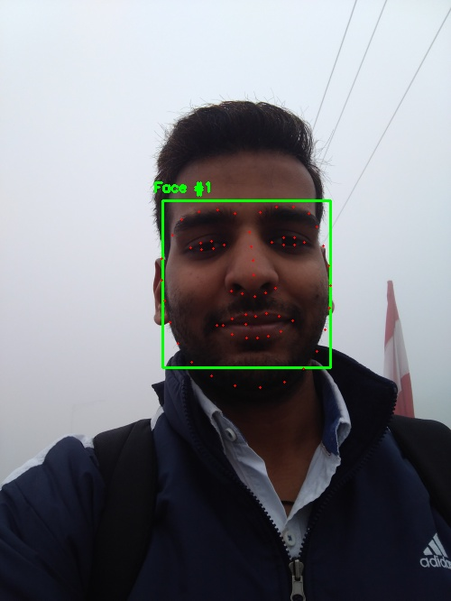
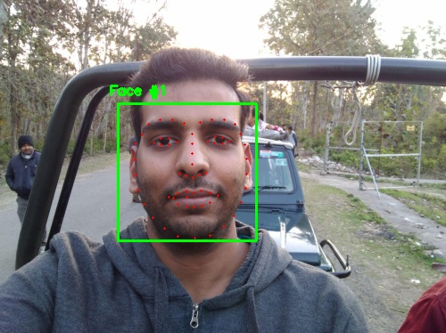

# Facial Landmarks Detection with DLIB
### Detects the face landmarks such as nose, eyes, etc. using just Python, OpenCV and dlib

Amazing and easy face landmarks detector with dlib library.

All thanks to Adrian Rosebrock (from [pyimagesearch](https://www.pyimagesearch.com/)) for making
great tutorials. This project is inspired from his blog: [Facial landmarks with dlib, OpenCV, and Python](https://www.pyimagesearch.com/2017/04/03/facial-landmarks-dlib-opencv-python/). I have included the author's code and the one i wrote my self as well.

## **Key Points**
1. Steps involved:
    1. Localize the face in the image
    2. Detect the key facial structures on the face ROI
2. Assumptions:
    1. We already have the trained face detector and face landmark detector.
3. Variety of things the face detector detects:
    1. Nose
    2. Mouth
    3. Left eye
    4. Right eye
    5. Left eyebrow
    6. Right eyebrow
    7. Jaw
4. Data required for training of dlib's facial landmark detector:
    1. Training set of labeled facial landmarks on the image.
    2. Priors: Probability on distance between pairs of input pixels
5. The dlib's face detector is an implementation of **One Millisecond Face Alignment with an Ensemble of Regression Trees** paper by Kazemi and Sullivan (2014).
6. 68 coordinates are detected for the given face by the face detector. The image is shown below.

7. dlib's framework can be trained to predict any shape. Hence it can be used for custom shape detections as well.
8. Used dlib's pre-trained face detector based on the modification of the standard **Histogram of Oriented Gradients + Linear SVM method** for object detection.
9. The face detector used up-scaling before face detection for better results.
10. This method works even for multiple faces in the image.

 ## **Requirements: (with versions i tested on)**
 1. python          (3.7.3)
 2. opencv          (4.1.0)
 3. numpy           (1.61.4)
 4. imutils         (0.5.2)
 5. dlib            (19.17.0)

 ## **Commands to run the detection:**
 ```
python facial_landmarks_mine.py --shape-predictor shape_predictor_68_face_landmarks.dat --image images/example_01.jpg
```

## **Results:**
The results are awesome. We can see pretty accurate face landmark detections.

**Input**


**Output**



**Input**


**Output**




## **The limitations**
None
